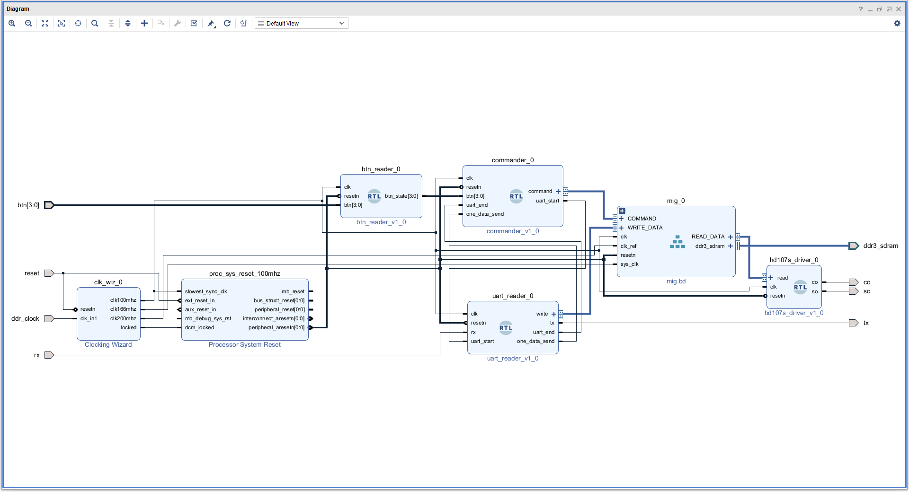
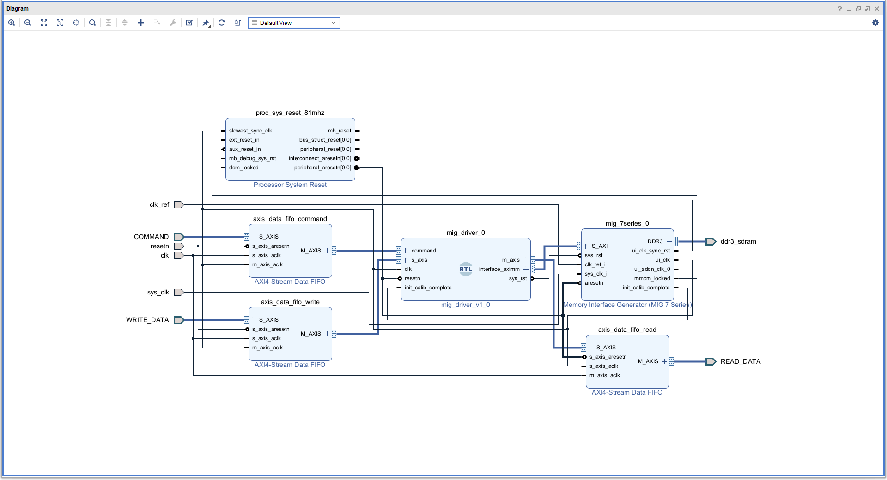

<link href="static/style.css" rel="stylesheet" type="text/css">
<script src="static/script.js"></script>

<div id="cover" style="page-break-after: always;">
<h1 class="not-contents title">Verilog HDLとLED制御回路</h1>
<h2 class="not-contents" id="date"></h2>
<a href="https://github.com/TTaisei/manual.git">ソースファイル</a>
</div>

<h1 class="not-contents">目次</h1>
<ol id="contents">
</ol>
<div style="page-break-before: always;"></div>

# Verilog HDL
基本文法については[VHDL/Verilog入門](https://miyo.github.io/learning_fpga/docs/book01/languages/)参照．

以下は補足説明．
## wireとreg
`wire`はただの配線で，`reg`はレジスタ．
### wire
組み合わせ回路を記述するときやモジュール間の結合に用いる．値を保持することはできず，入力のみで値が決定する．

宣言するときは，

```verilog
wire a = fuga;
wire [3:0] b = hoge;
```

とするか，

```verilog
wire a;
wire [3:0] b;

assign a = fuga;
assign b = hoge;
```

とする(どちらも同じ意味)．なお，`fuga`および`hoge`には外部信号や組み合わせ回路が入る．レジスタを入れてもよい．

あるタイミングで値を更新することができず，入力が変わるとクロック信号に関係なく値が変わる．

**`wire`は宣言時または`assign`文のみでしか値を指定できない！**
### reg
順序回路を記述するときに用いる．明示的に更新しない限り今の値を保つ．`always`文の中で，クロック信号の立ち上がりと同期させて値を更新する．

また，値が更新されるまでに若干のタイムラグがある．例えば以下の場合，`a`と`b`の値は正しく交換される．

```verilog
always @(posedge clk) begin
    a <= b;
    b <= a;
end
```

以下の回路では，`a`と`b`の初期値が`1'b0`のとき，`b`が`1'b1`になるまでに1クロック要する(最初の`clk`の立ち上がりでは，まだ`a`は`1'b0`なので`b`は更新されない)．

```verilog
always @(posedge clk) begin
    a <= 1'b1;
    if (a) begin
        b <= 1'b1;
    end
end
```

また以下の回路では，`a`を1ビットのレジスタとすると，`cnt`がインクリメントされるのは`a`の立下りのタイミングである．

```verilog
always @(posedge clk) begin
    a <= !a;
    if (a) begin
        cnt <= cnt + 32'b1;
    end
end
```

モジュール間の通信や，レジスタを参照する`if`文などではこのことを意識する必要がある．

**`always`文の中で`reg`を更新しても，それが反映されるのはクロック信号が次に立ち上がる時である！**
### inputとoutput
モジュールの入出力はデフォルトで`wire`になる．

`assign`文を用いることで出力する．

出力信号を`reg`とした場合，`always`文の中で出力を変更することができる．
## `begin`と`end`
ブロック内の記述が一行のみの時は`begin`，`end`が必要ない．

```verilog
if (a == b) c <= d;

// ↑等価↓

if (a == b) begin
    c <= d;
end
```

```verilog
always @(posedge clk) a <= b;

// ↑等価↓

always @(posedge clk) begin
    a <= b;
end
```

```verilog
case (a)
    default: b <= c;
endcase

// ↑等価↓

case (a)
    default: begin
        b <= c;
    end
endcase
```
## 配列操作
### 配列から取り出す
取り出した配列のビット数が，格納するバスのビット数より大きい場合，左側の収まりきらない信号は破棄される．また逆に取り出した配列が格納するバスのビット数より小さい場合，左側の足りない部分は0埋めされる．この時エラーは出ないため，このような状況が起きていても気づきにくく誤動作のもととなりうる．そのため以下の例の様に，明示的にビット数を合わせることを推奨する．

1ビットのみ取り出すとき

```verilog
// 8ビットの信号から1ビット取り出す
wire [7:0] a = fuga;
wire b = a[3];
```

複数取り出すとき

```verilog
// 8ビットの信号から4ビット取り出す
wire [7:0] a = fuga;
wire [3:0] b = a[5:2];
wire [3:0] c = {a[7], a[3:1]};
wire [3:0] d = {2'b0, a[2:1]};
```

なお，ハードウェア記述言語では，回路で表現できないため配列の添え字を変数にすることはできない．ただし，`case`文や`for`文などで代替できる場合は回路にすることができるため，この限りではない．
### 配列を作る
作った配列のビット数が，格納するバスのビット数と合わない場合，上記と同様の不具合が起きる．これも以下の例の様に明示的に対処すべきである．

```verilog
// 1ビット，8ビットの信号から8ビットの信号を作る
wire a = hoge;
wire [1:0] b = fuga;
wire [7:0] c = piyo;
wire [7:0] d = {2'b0, a, b, c[6], c[3:2]};
```
立ち上がり検出によく使われる書き方(立下り検出は`2'b10`)．

```verilog
if ({pre_a, a} == 2'b01) b <= 1'b1;
```
# RTLモジュール
Verilog HDLなど，ハードウェア記述言語を用いて作成したモジュール．

複数のモジュールを用いる場合はトップモジュールを設定する．その場合，トップモジュール及びトップモジュール内で直接または間接的に用いられているモジュールしか実際の回路にコンパイルされない．
## モジュール内にモジュール
あるRTLモジュール内に，別のRTLモジュールを埋め込むことができる．以下の様に行う．

```verilog
module outer(
    input clk,
    input resetn,

    input [1:0] in_data,
    output reg [1:0] out_data
);

    wire [1:0] out_data_wire;

    always @(posedge clk) begin
        if (!resetn) begin
            out_data <= 2'b0;
        end else begin
            out_data <= out_data_wire;
        end
    end

    // 埋め込み．
    // 位置はalways文より上でも構わない．

    // 埋め込むモジュール名，このモジュール内で呼ぶ名前
    // 入出力信号へつなぐ信号を指定．

    // 同じ種類のモジュールを複数埋め込んだり，
    // 埋め込むモジュールの出力に何もつなげなかったり，
    // 埋め込むモジュールの入力にマジックナンバーを入力してもよい．
    inner inner_1 (
        .clk(clk), .resetn(resetn),
        .in_data(in_data[0]),
        .out_data(out_data_wire[0])
    );
    inner inner_2 (
        .clk(clk), .resetn(resetn),
        .in_data(in_data[1]),
        .out_data(out_data_wire[1])
    );
endmodule


module inner(
    input clk,
    input resetn,

    input in_data,
    output out_data
);

    assign out_data = !in_data;

endmodule
```

なお，一つのVerilog HDLファイルに作成できるモジュールは一つまでと制限されているわけではないが，基本的には一つだけにするべきである(その際，モジュール名とファイル名は同一にしておくと分かりやすい)．一つのモジュール内でしか用いないようなモジュールを作成するときはこの限りではない．
## 定数
RTL内の定数を，外から設定することができる．

なお，後述するブロックデザインにこのようなRTLモジュールを入れるときでも，外から設定できる定数を作成することができる．その場合，ブロックをダブルクリックすることで設定画面が開ける．

```verilog
module outer (
    input clk,
    input resetn
);

    inner #(
        .DATA_WIDTH(10)
    ) inner1 (
        .clk(clk),
        .resetn(resetn)
    )

endmodule

module inner #(
    parameter fuga=3,
    parameter DATA_WIDTH=2 // デフォルト値
)(
    input clk,
    input resetn,
    output [DATA_WIDTH-1:0] out_data
);

endmodule
```
## シミュレーションファイル
モジュール内にモジュールを置く要領でシミュレーションモジュール内にシミュレーションしたいモジュールをインスタンス化し，それへの信号を作成することでシミュレーションができる．

トップモジュール以外のモジュールもテストできる．

なお，`#`の後に数字を書くことで指定した数字×ナノ秒待機する．

```verilog
module sim ();
    reg clk, in_data;
    wire [7:0] out_data
    top top (
        .clk(clk),
        .in_data(in_data),
        .out_data(out_data)
    );

    parameter integer CYCLE = 10;
    always #(CYCLE/2) clk <= !clk;

    initial begin
        clk = 1'b0;
        in_data = 1'b0;
        #100
        in_data = 1'b1;
        #100
        $finish();
    end
endmodule
```
# ブロックデザイン
作成したRTLモジュールや他のブロックデザイン，組み込みのIPを視覚的に配線するときに用いる．

「Create HDL Wrapper」によりラッパーファイルを作成し，それをトップモジュールに設定したりRTLモジュール内に埋め込んだりすることができる．ブロックデザイン内で他のブロックデザインを用いる場合は，ラッパーファイルを作成する必要はない．
# AXIS
AXI-Streamの略．Xilinxが提供している通信プロトコルの中で最も簡単なもの．
任意のビット数のデータを，マスターからスレーブに対して正しく送信するためのプロトコル．

FIFOなどで用いられる．

詳しくは[HDL/VivadoでAXIバスを利用#AXI4-Stream によるデータ転送](https://dora.bk.tsukuba.ac.jp/~takeuchi/?%E9%9B%BB%E6%B0%97%E5%9B%9E%E8%B7%AF%2FHDL%2FVivado%E3%81%A7AXI%E3%83%90%E3%82%B9%E3%82%92%E5%88%A9%E7%94%A8#r768d77f)を参照．

Verilog HDLを用いてAXISに必要な入出力信号を定義することで，ブロックデザインではAXISポートが自動で作成される．`tdata`や`tready`の前に書いた単語がそのままポート名になる(何も書かない場合デフォルトのポート名になる)．

```verilog
module fuga (
    // axis master側
    output [127:0] master_tdata,
    input master_tready,
    output master_tvalid,

    // axis slave側
    input [127:0] slave_tdata,
    output slave_tready,
    input slave_tvalid
)
```

ブロックデザインでは，AXISバス同士をつなげるだけで対応する信号をつなぐことができる．

マスター側は`tvalid`を任意のタイミングで立ててよい．逆に，`tready`信号が立つのを待ってから`tvalid`信号を立てることは禁止されている(デッドロック回避のため)．また，一度Highにした`tvalid`を，`tready`がHighになる前にLowに戻すことも禁止されている(これもデッドロック回避のため)．

スレーブ側は`tready`信号を以下のどちらかに従い制御する．
- 常に立てておき，受信を完了した次のクロックのみLowにする．
- Lowのまま`tvalid`が立つのを待機し，受信するときのみHighにする．

なおAXISにおける送受信は，基本的には1クロックで完結する．
# AXI
マスターからスレーブに対し，任意のビット数のデータを任意のアドレスに書き込む，または読み込むよう指示するためのプロトコル．

MIGに対して指示を送るときなどに用いられる．

詳しくは[AXI でプロセッサとつながる IP コアを作る (1)](https://www.acri.c.titech.ac.jp/wordpress/archives/8137)，[AXI でプロセッサとつながる IP コアを作る (2)](https://www.acri.c.titech.ac.jp/wordpress/archives/8503)を参照．

Verilog HDLを用いてAXIに必要な入出力信号を定義することで，ブロックデザインではAXIポートが自動で作成される．

```verilog
module fuga (
    // axi master側
    // aw
    output [27:0] awaddr,
    output [7:0] awlen,
    output [2:0] awsize,
    output awvalid,
    input awready,

    // w
    output [127:0] wdata,
    output wlast,
    output wvalid,
    input wready,

    // b
    output bready,
    input bvalid,

    // ar
    output [27:0] araddr,
    output [7:0] arlen,
    output [2:0] arsize,
    output arvalid,
    input arready,

    // r
    output rready,
    input [127:0] rdata,
    input rlast,
    input rvalid
)
```

ブロックデザインでは，AXIバス同士をつなげるだけで対応する信号をつなぐことができる．

またAXIにおける`valid`と`ready`についても，AXISと同様のルールが適用される．
# MIG
DDRにアクセスするためのモジュール．これに対してAXIプロトコルを用いて指示を与えることで，メモリの読み書きが可能．

なお，166MHzと200MHzのクロック信号が必要であるほか，MIGの制御モジュールはMIGから出力される`ui_clk`で動作させる必要がある．また初期化に若干の時間がかかり，初期化が完了したかどうかは`init_calib_complete`信号で判断できる(初期化が完了した時High)．

## 使い方
「ボード名+board file」のように検索し，そのボードのボードファイルをダウンロードし，所定の位置に置くことでVivado上でボード情報を扱うことができる．[VivadoにZyboの設定ファイルを読み込む方法(Vivado ML 2021.1版にも対応)](https://phys-higashi.com/73/)を参照．ボードが異なっても基本操作は同じ．

DDRをブロックデザインにドラッグアンドドロップすることでMIGが使える．ボードに合わせた(というより，ボードに搭載されたDDRに合わせた)細かい設定は自動で行われる．

なお，細かい設定を手動で行うこともでき，その場合は[MIG を使って DRAM メモリを動かそう (3)](https://www.acri.c.titech.ac.jp/wordpress/archives/7284)に従う．この記事ではブロックデザインを用いていないが，ブロックデザイン上でIPの追加からMIGを追加しダブルクリックすることで同様の設定画面が開ける．

## バースト長
MIGには「バースト長」という概念がある．これは複数のアドレスに同時にアクセスできるもので，Arty S7-50におけるバースト長は16である．

一つのアドレスにつき1バイト対応しているので，一度に16バイトを書き込み・読み込みできる．なおその際，16バイトを書き込んだ後に次の16バイトを書き込むとき，アドレスは1ずつではなく16ずつずらす必要がある．詳しくは[MIG を使って DRAM メモリを動かそう (2)#バーストモードでのアドレスの指定方法](https://www.acri.c.titech.ac.jp/wordpress/archives/6767#toc4)を参照．
# 注意点
モジュールの入力には，未配線でないか等の厳しいチェックが入るが，出力は未配線でも警告が出ない(未配線の時，GND信号が自動で接続される)．

配線されていないことに気づかずコンパイルしても正しく動作する保証はなく，にも関わらずエラーにはならない．

「配線されていない」とは，モジュール埋め込み時の信号の書き忘れ，ブロックデザインでの線の引き忘れ，`assign`文の書き忘れすべてを含む．これらすべてにおいて，警告が出ない．
# uart_mig_hd107s_continuity回路
今回作成した，UARTで四枚の画像情報を受け取り，MIGでDDRに保存し，その後押されたボタンに対応した画像データをDDRから読み取りLEDに表示する回路である．
## Python
画像データの作成・送信にはPythonを用いた．
### make_img
画像作成プログラム．青，緑，赤，白の四枚．

```py
import cv2
import numpy as np

img = np.zeros((2, 10, 3), dtype=np.uint8)

img[:, :] = np.array([255, 0, 0], dtype=np.uint8)
cv2.imwrite("img/00.png", img)
img[:, :] = np.array([0, 255, 0], dtype=np.uint8)
cv2.imwrite("img/01.png", img)
img[:, :] = np.array([0, 0, 255], dtype=np.uint8)
cv2.imwrite("img/02.png", img)
img[:, :] = np.array([255, 255, 255], dtype=np.uint8)
cv2.imwrite("img/03.png", img)
```
### img2b
画像をコマンドに変換し，バイナリファイルで保存するプログラム．

```py
from glob import glob

import cv2

for i, filename in enumerate(glob("img/*.png")):
    img = cv2.imread(filename)
    with open(f"img_b/{i:02}.b", "wb") as fp:
        # スタートビット
        fp.write(bytes([0x00, 0x00, 0x00, 0x00]))
        fp.write(bytes([0x00, 0x00, 0x00, 0x00]))
        for y in range(img.shape[0]):
            for x in range(img.shape[1]):
                # 各LEDのスタート信号と明るさ
                fp.write(b"\xe1")
                for c in range(3):
                    fp.write(bytes([img[y, x, c]]))
        # エンドビット
        fp.write(bytes([0xff, 0xff, 0xff, 0xff]))
        fp.write(bytes([0xff, 0xff, 0xff, 0xff]))
```
### send
バイナリファイルを読み，シリアル通信で送信するプログラム．

```py
from glob import glob

import serial

ser = serial.Serial("COM6", 1000*1000)

for filename in glob("img_b/*.b"):
    with open(filename, "rb") as fp:
        ser.write(fp.read())

ser.close()
```
## ブロックデザイン
ブロックデザインによる，全体の構成を示す．各モジュールの詳細は後述する．
### top
トップモジュール代わりのブロックデザイン．このラッパーファイルがトップモジュールとなる．



### mig
MIGを操作するためのモジュールをまとめたもの．top.bd内で用いる．

MIGを制御するモジュールは`ui_clk`で動作させるため，シリアル通信などを行うモジュールとはクロックが異なる．その差を吸収するため，外部との通信はすべて非同期FIFOを介している．



## IP
Vivadoにあらかじめ用意されているモジュール．

各モジュールの使用箇所や配線は[ブロックデザイン-top](#top)または[ブロックデザイン-mig](#mig-1)内にて確認可能．

[Vivado IP Integratorでよく使う便利なIPコア16選](https://qiita.com/s_nkg/items/f2928fb727238d14f23f)にて，便利なIPが紹介されている．
### Clocking Wizard
入力されたクロック信号から，任意の周期のクロック信号を作成する．出力クロック信号の安定度合いは`locked`信号で判断できる．
### Processor System Reset
起動してからクロック信号が安定するまで，リセットをオンにする(`Active High`の時High，`Active Low`の時Lowにする)モジュール．また，非同期のリセット信号をクロック信号に同期させる．

必須ではないが，使用が推奨されている．詳しくは[Processor System Reset](https://note.com/koujibou/n/nf3b9e1031007)を参照．
### AXI4-Stream Data FIFO
前述したAXISプロトコルを用いた，非同期にも対応できるFIFO．なお，デフォルトでは同期FIFOとなる．詳しくは["AXI なんとか FIFO" の雑な違い..(?)](https://e-tipsmemo.hatenablog.com/entry/2017/08/04/234203)，[AXI4-Stream Infrastructure IP Suite v3.0 LogiCORE IP Product Guide#AXI4-Stream Data FIFO](https://docs.xilinx.com/r/en-US/pg085-axi4stream-infrastructure/AXI4-Stream-Data-FIFO?tocId=gW4t0Jw9QzLGL2RgpNW2nw)を参照．

設定画面にて，データの幅やFIFOの深さが設定可能．

なお，非同期FIFOを用いる場合，`Memory Type`は`Distributed RAM`を選択する．詳しくは[基礎から学ぶVerilog HDL&FPGA設計](https://www.cqpub.co.jp/dwm/contents/0126/dwm012601570.pdf)を参照．
### MIG
上述した，DDRへアクセスするためのモジュール．
## RTLモジュール
回路作成時，出力信号に`reg`が使えることを知らなかったため，`reg`に入れた値を`assign`文で出力する方法を多用している．一部の出力信号は`reg`になっている．

各モジュールの使用箇所や配線は[ブロックデザイン-top](#top)または[ブロックデザイン-mig](#mig-1)内にて確認可能．
### btn_reader
チャタリングを考慮し，押されたボタンに応じた信号を出力する．なお，同時に複数のボタンが押されることは想定していない．

前回押されたものと別のボタンが押されるまで出力は変化しない．

```verilog
module btn_reader(
    input clk,
    input resetn,

    input [3:0] btn,        // ボタンに直接つながっている
    output [3:0] btn_state  // チャタリングを除いたボタンの状態
    );

    // チャタリングを考慮し，待機する時間
    parameter WAIT_TIME = 32'd10_000_000;

    reg [31:0] count = 32'b1;
    reg [1:0] place = 2'b0;
    reg [3:0] btn_reg = 4'b0;
    reg mode = 1'b0;

    always @(posedge clk) begin
        if (!resetn) begin
            count <= 32'b1;
            place <= 2'b0;
            btn_reg <= 4'b0;
            mode <= 1'b0;
        end else begin
            // ボタンが押されたとき
            if (btn != 4'h0 && !mode) begin
                // 押されたボタンに応じて`place`レジスタに異なる値を入れ，
                // モードをオンにする．
                case (btn)
                    4'b0001: begin
                        place <= 2'b00;
                        mode <= 1'b1;
                    end
                    4'b0010: begin
                        place <= 2'b01;
                        mode <= 1'b1;
                    end
                    4'b0100: begin
                        place <= 2'b10;
                        mode <= 1'b1;
                    end
                    4'b1000: begin
                        place <= 2'b11;
                        mode <= 1'b1;
                    end
                    default: mode <= 1'b0;
                endcase
            end

            // モードがオンの時，`WAIT_TIME`だけ待機し，
            // その後出力を変化させる(チャタリング除去のため)
            if (mode) begin
                if (count == WAIT_TIME) begin
                    count <= 32'b1;
                    mode <= 1'b0;
                    case (place)
                        2'b00: btn_reg <= 4'b0001;
                        2'b01: btn_reg <= 4'b0010;
                        2'b10: btn_reg <= 4'b0100;
                        2'b11: btn_reg <= 4'b1000;
                    endcase
                end else begin
                    count <= count + 32'b1;
                end
            end
        end
    end

    assign btn_state = btn_reg;

endmodule
```
### commander
全体に指示を与え統括するモジュール．

MIGを制御するモジュール`mig_driver`に与えるコマンドは全32ビットで，上位4ビットが書き込みまたは読み込みを指定し，残り28ビットがアドレスを指定する．なお，アドレスはバースト長を考慮し下位4ビットを`4'b0`にしている．

```verilog
module commander(
    input clk,
    input resetn,

    input [3:0] btn,  // ボタンの状態

    // シリアル通信モジュールとの通信信号
    output reg uart_start,
    input uart_end,
    input one_data_send,

    // command
    output [31:0] command_tdata,
    input command_tready,
    output command_tvalid
    );

    // 各設定
    parameter integer IMG_NUM = 4;
    parameter integer START_NUM = 2;
    parameter integer LED_NUM = 20;
    parameter integer END_NUM = 2;
    parameter integer COMMAND_NUM = IMG_NUM * (START_NUM + LED_NUM + END_NUM);
    parameter integer DATA_NUM = COMMAND_NUM * 32 / 128;
    parameter integer ONE_DATA_NUM = DATA_NUM / IMG_NUM;
    parameter integer TWO_DATA_NUM = 2 * ONE_DATA_NUM;
    parameter integer THR_DATA_NUM = 3 * ONE_DATA_NUM;

    // コマンド定義
    parameter [3:0] READ_COMMAND = 4'b0;
    parameter [3:0] WRITE_COMMAND = 4'b1;

    // 状態
    parameter [2:0] IDLE = 3'd0;
    parameter [2:0] UART = 3'd1;
    parameter [2:0] BTN = 3'd3;

    // 状態を保存するレジスタ
    reg [2:0] state = IDLE;

    reg [3:0] pre_btn = 4'b0;
    reg pre_one_data_send = 1'b0;

    reg [3:0] command = READ_COMMAND;
    reg [23:0] addr = 24'b0;

    reg tvalid_reg = 1'b0;

    always @(posedge clk) begin
        pre_btn <= btn;
        pre_one_data_send <= one_data_send;
        if (!resetn) begin
            state <= IDLE;

            uart_start <= 1'b0;

            command <= READ_COMMAND;
            addr <= 24'b0;

            tvalid_reg <= 1'b0;
        end else begin
            case (state)
                // 初期状態
                IDLE: begin
                    state <= UART;
                    uart_start <= 1'b1;
                end

                // シリアル通信を受信する
                UART: begin
                    // `uart_reader`が128ビットの信号を
                    // 一通り読み込んだら，DDRへ書き込むデータをFIFOへ送るので，
                    // それと同時に書き込み命令を`mig_driver`へ送る．
                    if ({pre_one_data_send, one_data_send} == 2'b01) begin
                        command <= WRITE_COMMAND;
                        tvalid_reg <= 1'b1;
                    end

                    // コマンドが読み取られたら，送信を終了し，
                    // アドレスをインクリメント
                    if (tvalid_reg && command_tready) begin
                        tvalid_reg <= 1'b0;
                        addr <= addr + 24'b1;
                    end

                    // シリアル通信が終了すれば，次の状態へ遷移
                    if (uart_end) begin
                        state <= BTN;
                        uart_start <= 1'b0;
                    end
                end

                // ボタンの状態を読む
                // 変化があれば読み取りコマンド送信
                BTN: begin
                    if (pre_btn != btn) begin
                        command <= READ_COMMAND;
                        case (btn)
                            4'b0001: addr <= 24'h0;
                            4'b0010: addr <= ONE_DATA_NUM[23:0];
                            4'b0100: addr <= TWO_DATA_NUM[23:0];
                            4'b1000: addr <= THR_DATA_NUM[23:0];
                            default: addr <= 24'h0;
                        endcase
                        tvalid_reg <= 1'b1;
                    end

                    // コマンドが読み取られたら，送信を終了する
                    if (tvalid_reg && command_tready) begin
                        tvalid_reg <= 1'b0;
                    end
                end
            endcase
        end
    end

    assign command_tdata = {command, addr, 4'b0};
    assign command_tvalid = tvalid_reg;

endmodule
```
### uart_reader
baudrateが1MHzのシリアル通信を読む．なお安定化のため，立下りを検出し終わってから半周期後の信号を読んでいる．

`tlast`信号を用いているが，必要ないと思われる．

```verilog
module uart_reader(
    input clk,
    input resetn,

    // シリアル通信
    input rx,
    output tx,

    // `commander`との通信
    input uart_start,
    output uart_end,
    output one_data_send,

    // m_axis
    output [127:0] write_tdata,
    output write_tlast,
    input write_tready,
    output write_tvalid
    );

    // シリアル通信用の定数
    parameter [31:0] DIV = 32'd50;
    parameter [31:0] IMG_NUM = 32'd4;

    // 状態
    parameter [1:0] IDLE = 2'b00;
    parameter [1:0] START = 2'b01;
    parameter [1:0] READ = 2'b10;
    parameter [1:0] CLOSE = 2'b11;

    reg [31:0] count = 32'b1;
    reg [7:0] temp = 8'b0;  // 1バイトぶん保存しておくレジスタ
    reg [7:0] mask = 8'b1;  // 今受信しているのが8ビットのうちどの部分か

    reg [1:0] state = IDLE;
    reg flag = 1'b1;        // 受信を行うか

    // 今受け取った8ビットを，128ビットあるコマンドのどこに保存するか
    reg [3:0] signal_place = 4'b0;
    reg send_mode = 1'b0;

    reg [127:0] tdata_reg = 128'b0;
    reg tlast_reg = 1'b0;
    reg tvalid_reg = 1'b0;

    reg [2:0] img_count = 3'd1;

    always @(posedge clk) begin
        if (!resetn) begin
            state <= IDLE;
            flag <= 1'b1;

            count <= 32'b1;
            signal_place <= 4'b0;
            send_mode <= 1'b0;

            tdata_reg <= 128'b0;
            tlast_reg <= 1'b0;
            tvalid_reg <= 1'b0;

            img_count <= 3'd1;
        end else begin
            // シリアル通信のための分周
            if (count == DIV) begin
                count <= 32'b1;

                case (state)
                    // 初期状態
                    IDLE: begin
                        if (!rx && uart_start) begin
                            state <= START;
                        end
                    end

                    // スタートビット
                    START: begin
                        state <= READ;
                        mask <= 1'b1;
                        temp <= 8'b0;
                    end

                    // データの読み取り
                    // 安定のため，二回に一回読み取り
                    READ: begin
                        flag <= !flag;
                        // 読み取り部分
                        if (flag) begin
                           temp <= rx ? temp | mask : temp;
                           mask <= {mask[6:0], 1'b0};
                        end
                        // 8ビットの読み取りが完了したら
                        // 状態は`IDLE`に戻り，次のスタートビットを待つ
                        // 128ビット読み込んだときのみ状態が`CLOSE`に移る
                        if (mask == 8'b00) begin
                            signal_place <= signal_place + 4'b1;
                            mask <= 8'b1;
                            case (signal_place)
                                4'h0: begin
                                    tdata_reg[127:120] <= temp;
                                    state <= IDLE;
                                end
                                4'h1: begin
                                    tdata_reg[119:112] <= temp;
                                    state <= IDLE;
                                end
                                4'h2: begin
                                    tdata_reg[111:104] <= temp;
                                    state <= IDLE;
                                end
                                4'h3: begin
                                    tdata_reg[103:96]  <= temp;
                                    state <= IDLE;
                                end
                                4'h4: begin
                                    tdata_reg[95:88]   <= temp;
                                    state <= IDLE;
                                end
                                4'h5: begin
                                    tdata_reg[87:80]   <= temp;
                                    state <= IDLE;
                                end
                                4'h6: begin
                                    tdata_reg[79:72]   <= temp;
                                    state <= IDLE;
                                end
                                4'h7: begin
                                    tdata_reg[71:64]   <= temp;
                                    state <= IDLE;
                                end
                                4'h8: begin
                                    tdata_reg[63:56]   <= temp;
                                    state <= IDLE;
                                end
                                4'h9: begin
                                    tdata_reg[55:48]   <= temp;
                                    state <= IDLE;
                                end
                                4'ha: begin
                                    tdata_reg[47:40]   <= temp;
                                    state <= IDLE;
                                end
                                4'hb: begin
                                    tdata_reg[39:32]   <= temp;
                                    state <= IDLE;
                                end
                                4'hc: begin
                                    tdata_reg[31:24]   <= temp;
                                    state <= IDLE;
                                end
                                4'hd: begin
                                    tdata_reg[23:16]   <= temp;
                                    state <= IDLE;
                                end
                                4'he: begin
                                    tdata_reg[15:8]    <= temp;
                                    state <= IDLE;
                                end
                                4'hf: begin
                                    tdata_reg[7:0]     <= temp;
                                    state <= CLOSE;
                                end
                            endcase
                        end
                    end

                    // 読み込んだデータを送信
                    CLOSE: begin
                        send_mode <= 1'b1;
                        state <= IDLE;
                        if (tdata_reg[31:0] == 32'hffffffff) begin
                            if (img_count == IMG_NUM) begin
                                tlast_reg <= 1'b1;
                            end else begin
                                img_count <= img_count + 3'b1;
                            end
                        end
                    end
                endcase
            end else begin
                count <= count + 32'b1;
            end

            // 送信処理
            // 相手が受信すれば，送信を終了する．
            if (send_mode) begin
                if (tvalid_reg && write_tready) begin
                    tvalid_reg <= 1'b0;
                    tlast_reg <= 1'b0;
                    send_mode <= 1'b0;
                end else begin
                    tvalid_reg <= 1'b1;
                end
            end

        end
    end

    assign tx = rx;

    assign uart_end = tlast_reg;

    assign one_data_send = tvalid_reg;

    assign write_tdata = tdata_reg;
    assign write_tlast = tlast_reg;
    assign write_tvalid = tvalid_reg;

endmodule
```
### hd107s_driver
LED(hd107s)を制御するためのモジュール．FIFOから信号を受け取り，それを出力する．

```verilog
module hd107s_driver(
    input clk,
    input resetn,

    // LEDを制御する信号
    output co,
    output so,

    // s_axis
    input [127:0] read_tdata,
    input read_tlast,
    output read_tready,
    input read_tvalid
    );

    // hd107sを制御するための分周
    parameter [31:0] DIV = 32'd2;

    reg [127:0] color = 128'b0;    // 信号(LED4つぶん)
    reg [31:0] count = 32'b1;
    reg mode = 1'b0;               // 信号を送信するかどうか
    reg [6:0] color_place = 7'h7f; // 送る信号の位置

    reg tready_reg = 1'b0;

    reg co_reg = 1'b0;  // hd107sに送るクロック
    reg so_reg = 1'b1;  // hd107sに送る信号

    reg m_mode = 1'b0;

    always @(posedge clk) begin
        if (!resetn) begin
            color <= 128'b0;
            count <= 32'b1;
            mode <= 1'b0;
            color_place <= 7'h7f;

            tready_reg <= 1'b0;

            co_reg <= 1'b0;
            so_reg <= 1'b1;

            m_mode <= 1'b0;
        end else begin
            // 送信する信号を更新する
            color <= tready_reg ? read_tdata : color;

            // 信号をLEDへ送る
            if (count == DIV) begin
                count <= 32'b1;
                co_reg <= !co_reg;

                // 立下りのタイミングで信号を更新
                if (mode && co_reg) begin
                    so_reg <= color[color_place];
                    color_place <= color_place - 7'b1;
                end
                // 送信し終えたら
                if (mode && !co_reg && color_place == 7'h7f) begin
                    tready_reg <= 1'b1;
                    // コマンドすべてを受け取り終わったら
                    // 送信モード終了
                    mode <= read_tvalid;
                end
            end else begin
                count <= count + 32'b1;

                tready_reg <= 1'b0;
                // アドレスが送られてきたら送信モードオン
                if (read_tvalid) begin
                    mode <= 1'b1;
                end
            end
        end
    end

    assign co = co_reg;
    assign so = so_reg;

    assign read_tready = tready_reg;

endmodule
```
### mig_driver
MIGを制御するためのモジュール．`commander`モジュールから指示を受け取り，上述したAXIプロトコルを用いてMIGに対して指示を送る．

なお，実際に指示を送るのは`mig_reader`及び`mig_writer`モジュールである．`mig_driver`は二つのモジュールに対し指示を送ることで間接的にMIGを制御する．MIGを制御するための信号のうちリセット信号および初期化完了信号のみを管理し，それ以外の信号を`mig_reader`または`mig_writer`が管理している．

```verilog
module mig_driver(
    input clk,
    input resetn,

    input init_calib_complete, // 初期化完了信号
    output sys_rst,            // リセット信号

    // command
    input [31:0] command_tdata,
    output command_tready,
    input command_tvalid,

    // write data
    input [127:0] s_axis_tdata,
    input s_axis_tlast,
    output s_axis_tready,
    input s_axis_tvalid,

    // read data
    output [127:0] m_axis_tdata,
    output m_axis_tlast,
    input m_axis_tready,
    output m_axis_tvalid,

    // aw
    output [27:0] awaddr,
    output [7:0] awlen,
    output [2:0] awsize,
    output awvalid,
    input awready,

    // w
    output [127:0] wdata,
    output wlast,
    output wvalid,
    input wready,

    // b
    output bready,
    input bvalid,

    // ar
    output [27:0] araddr,
    output [7:0] arlen,
    output [2:0] arsize,
    output arvalid,
    input arready,

    // r
    output rready,
    input [127:0] rdata,
    input rlast,
    input rvalid
    );

    // 各設定
    parameter [31:0] IMG_NUM = 32'd4;
    parameter [31:0] START_NUM = 32'd2;
    parameter [31:0] LED_NUM = 32'd20;
    parameter [31:0] END_NUM = 32'd2;
    parameter [31:0] COMMAND_NUM = IMG_NUM * (START_NUM + LED_NUM + END_NUM);
    parameter [31:0] DATA_NUM = COMMAND_NUM * 32 / 128;
    parameter [31:0] ONE_DATA_NUM = DATA_NUM / IMG_NUM;
    parameter integer WAIT_TIME = 32'd20;

    // 状態
    parameter [2:0] IDLE = 3'd0;
    parameter [2:0] RECIEVE = 3'd1;
    parameter [2:0] WRITE = 3'd2;
    parameter [2:0] READ = 3'd3;
    parameter [2:0] SEND = 3'd4;
    parameter [2:0] WAIT = 3'd5;

    // コマンド
    parameter [3:0] READ_COMMAND = 4'b0;
    parameter [3:0] WRITE_COMMAND = 4'b1;

    reg [2:0] state = IDLE;

    reg s_tready_reg = 1'b0;
    reg m_tvalid_reg = 1'b0;
    reg m_tlast_reg = 1'b0;
    reg command_tready_reg = 1'b0;
    reg [127:0] tdata_reg = 128'b0;

    reg [127:0] data_w = 128'b0;
    wire [127:0] data_r;
    reg wstart = 1'b0;
    reg rstart = 1'b0;
    reg [27:0] addr = 28'b0;

    wire wend, rend;

    reg [31:0] data_count = 32'b1;

    reg [31:0] wait_count = 32'b1;

    always @(posedge clk) begin
        if (!resetn || !init_calib_complete) begin
            state <= IDLE;

            s_tready_reg <= 1'b0;
            m_tvalid_reg <= 1'b0;
            m_tlast_reg <= 1'b0;
            command_tready_reg <= 1'b0;
            tdata_reg <= 128'b0;

            data_w <= 128'b0;
            wstart <= 1'b0;
            rstart <= 1'b0;
            addr <= 28'b0;

            data_count <= 32'b1;
            wait_count <= 32'b1;
        end else begin
            case (state)
                // コマンドが来るまで待機
                IDLE: begin
                    // コマンドが来たとき
                    if (command_tvalid) begin
                        command_tready_reg <= 1'b0;
                        addr <= command_tdata[27:0];
                        // コマンドに応じて処理を変える
                        case (command_tdata[31:28])
                            WRITE_COMMAND: begin
                                state <= RECIEVE;
                                s_tready_reg <= 1'b1;
                            end

                            READ_COMMAND: begin
                                state <= READ;
                            end

                            default:;
                        endcase
                    // コマンドが来たとき以外
                    end else begin
                        command_tready_reg <= 1'b1;
                        s_tready_reg <= 1'b0;
                        m_tvalid_reg <= 1'b0;
                        m_tlast_reg <= 1'b1;
                        data_count <= 32'b1;
                    end
                end

                // DDRに書き込むデータを受け取る
                RECIEVE: begin
                    if (s_axis_tvalid) begin
                        s_tready_reg <= 1'b0;
                        data_w <= s_axis_tdata;
                        wstart <= 1'b1;
                        state <= WRITE;
                    end else begin
                        s_tready_reg <= 1'b1;
                    end
                end

                // 受け取ったデータをDDRの指定されたアドレスに書き込む
                WRITE: begin
                    if (wend) begin
                        addr <= addr + 28'd16;
                        wstart <= 1'b0;
                        data_count <= data_count + 32'b1;
                        // すべてのデータを受け取ったら
                        if (data_count == DATA_NUM) begin
                            state <= IDLE;
                        // まだ受け取るデータがあるなら
                        end else begin
                            command_tready_reg <= 1'b1;
                            state <= RECIEVE;
                        end
                    end else begin
                        wstart <= 1'b1;
                    end
                end

                // DDRの指定されたアドレスから読み込む
                READ: begin
                    if (rend) begin
                        addr <= addr + 28'd16;
                        rstart <= 1'b0;
                        state <= SEND;

                        m_tvalid_reg <= 1'b1;
                        tdata_reg <= data_r;
                    end else begin
                        rstart <= 1'b1;
                    end
                end

                // 読み込んだデータを送信する
                SEND: begin
                    if (m_axis_tready) begin
                        m_tvalid_reg <= 1'b0;
                        data_count <= data_count + 32'b1;
                        // すべてのデータを送信したら
                        if (data_count == ONE_DATA_NUM) begin
                            state <= IDLE;
                            m_tlast_reg <= 1'b1;
                        // まだ送信するデータがあるなら
                        end else begin
                            state <= READ;
                        end
                    end
                end
            endcase
        end
    end

    // MIGのリセット信号(Active Low)
    assign sys_rst = 1'b1;

    assign command_tready = command_tready_reg;

    assign s_axis_tready = s_tready_reg;
    assign m_axis_tdata = tdata_reg;
    assign m_axis_tvalid = m_tvalid_reg;
    assign m_axis_tlast = m_tlast_reg;

    mig_writer mig_writer_0 (
        .clk(clk),
        .resetn(resetn),

        .wstart(wstart),
        .wend(wend),
        .addr(addr),
        .data(data_w),

        .awaddr(awaddr),
        .awlen(awlen),
        .awsize(awsize),
        .awvalid(awvalid),
        .awready(awready),

        .wdata(wdata),
        .wlast(wlast),
        .wvalid(wvalid),
        .wready(wready),

        .bready(bready),
        .bvalid(bvalid)
    );

    mig_reader mig_reader_0 (
        .clk(clk),
        .resetn(resetn),

        .rstart(rstart),
        .rend(rend),
        .addr(addr),
        .data(data_r),

        .araddr(araddr),
        .arlen(arlen),
        .arsize(arsize),
        .arvalid(arvalid),
        .arready(arready),

        .rready(rready),
        .rdata(rdata),
        .rlast(rlast),
        .rvalid(rvalid)
    );

endmodule
```
### mig_reader
`mig_driver`から指示を受け，読み取りをMIGに対して指示する．

MIGの制御信号のうち，読み取りに関する部分を管理する．

```verilog
module mig_reader(
    input clk,
    input resetn,

    input rstart,         // 読み取り開始命令
    output rend,          // 読み取り終了の報告
    input [27:0] addr,    // 読み取るアドレス
    output [127:0] data,  // 読み取ったデータ

    // ar
    output [27:0] araddr,
    output [7:0] arlen,
    output [2:0] arsize,
    output arvalid,
    input arready,

    // r
    output rready,
    input [127:0] rdata,
    input rlast,
    input rvalid
    );

    // 状態
    parameter [1:0] IDLE = 2'd0;
    parameter [1:0] ADDR_SEND = 2'd1;
    parameter [1:0] DATA_RECEIVE = 2'd2;

    reg [1:0] state = IDLE;
    reg mode = 1'b0;

    reg [127:0] data_reg = 128'b0;

    reg arvalid_reg = 1'b0;
    reg rready_reg = 1'b0;

    reg rend_reg = 1'b0;

    always @(posedge clk) begin
        if (!resetn) begin
            state <= IDLE;
            mode <= 1'b0;

            data_reg <= 128'b0;

            arvalid_reg <= 1'b0;
            rready_reg <= 1'b0;

            rend_reg <= 1'b0;
        end else begin
            if (mode) begin
                case (state)
                    // MIGに対しアドレスを送信
                    ADDR_SEND: begin
                        if (arready) begin
                            arvalid_reg <= 1'b0;
                            state <= DATA_RECEIVE;
                            rready_reg <= 1'b1;
                        end else begin
                            arvalid_reg <= 1'b1;
                        end
                    end

                    // MIGからデータを受け取る
                    DATA_RECEIVE: begin
                        if (rvalid) begin
                            rready_reg <= 1'b0;
                            data_reg <= rdata;
                            state <= IDLE;
                            mode <= 1'b0;
                            rend_reg <= 1'b1;
                        end
                    end
                endcase
            end else begin
                rready_reg <= 1'b1;
                rend_reg <= 1'b0;
                // 読み取り開始指示を受けたら
                if (rstart) begin
                    mode <= 1'b1;
                    state <= ADDR_SEND;
                    arvalid_reg <= 1'b1;
                end
            end
        end
    end

    assign rend = rend_reg;
    assign data = data_reg;

    assign araddr = addr;
    assign arlen = 8'b0;
    assign arsize = 3'b100;
    assign arvalid = arvalid_reg;

    assign rready = rready_reg;

endmodule
```
### mig_writer
`mig_driver`から指示を受け，書き込みをMIGに対して指示する．なお，読み取りと書き込みが異なるだけで，基本的には`mig_reader`とほぼ同じ処理をしている．

MIGの制御信号のうち，書き込みに関する部分を管理する．

```verilog
module mig_writer(
    input clk,
    input resetn,

    input wstart,        // 書き込み開始命令
    output wend,         // 書き込み終了の報告
    input [27:0] addr,   // 書き込むアドレス
    input [127:0] data,  // 書き込むデータ

    // aw
    output [27:0] awaddr,
    output [7:0] awlen,
    output [2:0] awsize,
    output awvalid,
    input awready,

    // w
    output [127:0] wdata,
    output wlast,
    output wvalid,
    input wready,

    // b
    output bready,
    input bvalid
    );

    // 状態
    parameter [2:0] IDLE = 3'd0;
    parameter [2:0] ADDR_SEND = 3'd1;
    parameter [2:0] DATA_SEND = 3'd2;
    parameter [2:0] B = 3'd3;

    reg [2:0] state = IDLE;
    reg mode = 1'b0;

    reg awvalid_reg = 1'b0;
    reg wvalid_reg = 1'b0;
    reg bready_reg = 1'b0;

    reg wend_reg = 1'b0;

    always @(posedge clk) begin
        if (!resetn) begin
            state <= IDLE;
            mode <= 1'b0;

            awvalid_reg <= 1'b0;
            wvalid_reg <= 1'b0;
            bready_reg <= 1'b0;

            wend_reg <= 1'b0;
        end else begin
            if (mode) begin
                case (state)
                    // MIGへ書き込むアドレスを送信する
                    ADDR_SEND: begin
                        if (awready) begin
                            awvalid_reg <= 1'b0;
                            state <= DATA_SEND;
                            wvalid_reg <= 1'b1;
                        end else begin
                            awvalid_reg <= 1'b1;
                        end
                    end

                    // MIGへ書き込むデータを送信する
                    DATA_SEND: begin
                        if (wready) begin
                            wvalid_reg <= 1'b0;
                            state <= B;
                        end else begin
                            wvalid_reg <= 1'b1;
                        end
                    end

                    // 書き込みがうまくいったことを確認する
                    B: begin
                        if (bvalid) begin
                            mode <= 1'b0;
                            bready_reg <= 1'b0;
                            state <= IDLE;
                            wend_reg <= 1'b1;
                        end
                    end
                endcase
            end else begin
                bready_reg <= 1'b1;
                wend_reg <= 1'b0;
                // 書き込み開始指示を受けたら
                if (wstart) begin
                    mode <= 1'b1;
                    state <= ADDR_SEND;
                    awvalid_reg <= 1'b1;
                end
            end
        end
    end

    assign wend = wend_reg;

    assign awaddr = addr;
    assign awlen = 8'b0;
    assign awsize = 3'b100;
    assign awvalid = awvalid_reg;

    assign wdata = data;
    assign wlast = 1'b1;
    assign wvalid = wvalid_reg;

    assign bready = bready_reg;

endmodule
```
## 制約ファイル
トップモジュールの入出力信号を，FPGAのどこに接続するかを指定するファイル．

```xdc
# おまじない
set_property CLOCK_DEDICATED_ROUTE BACKBONE [get_nets top_i/clk_wiz_0/inst/clk_in1_top_clk_wiz_0_0]

# Buttons
set_property -dict { PACKAGE_PIN G15   IOSTANDARD LVCMOS33 } [get_ports { btn[0] }]; #IO_L18N_T2_A23_15 Sch=btn[0]
set_property -dict { PACKAGE_PIN K16   IOSTANDARD LVCMOS33 } [get_ports { btn[1] }]; #IO_L19P_T3_A22_15 Sch=btn[1]
set_property -dict { PACKAGE_PIN J16   IOSTANDARD LVCMOS33 } [get_ports { btn[2] }]; #IO_L19N_T3_A21_VREF_15 Sch=btn[2]
set_property -dict { PACKAGE_PIN H13   IOSTANDARD LVCMOS33 } [get_ports { btn[3] }]; #IO_L20P_T3_A20_15 Sch=btn[3]

# LED制御ピン
set_property -dict { PACKAGE_PIN H16   IOSTANDARD LVCMOS33 } [get_ports { co }]; #IO_L22P_T3_A17_15   Sch=ck_io10_ss
set_property -dict { PACKAGE_PIN H17   IOSTANDARD LVCMOS33 } [get_ports { so }]; #IO_L22N_T3_A16_15   Sch=ck_io11_mosi

# シリアル信号ピン
set_property -dict { PACKAGE_PIN K14   IOSTANDARD LVCMOS33 } [get_ports { tx }]; #IO_L23P_T3_FOE_B_15 Sch=ck_io12_miso
set_property -dict { PACKAGE_PIN G16   IOSTANDARD LVCMOS33 } [get_ports { rx }]; #IO_L14P_T2_SRCC_15  Sch=ck_io13_sck

# おまじない
set_property BITSTREAM.CONFIG.CONFIGRATE 50 [current_design]
set_property CONFIG_VOLTAGE 3.3 [current_design]
set_property CFGBVS VCCO [current_design]
set_property BITSTREAM.CONFIG.SPI_BUSWIDTH 4 [current_design]
set_property CONFIG_MODE SPIx4 [current_design]

# おまじない
set_property INTERNAL_VREF 0.675 [get_iobanks 34]
```

<script>
    contents();
    date();
</script>
